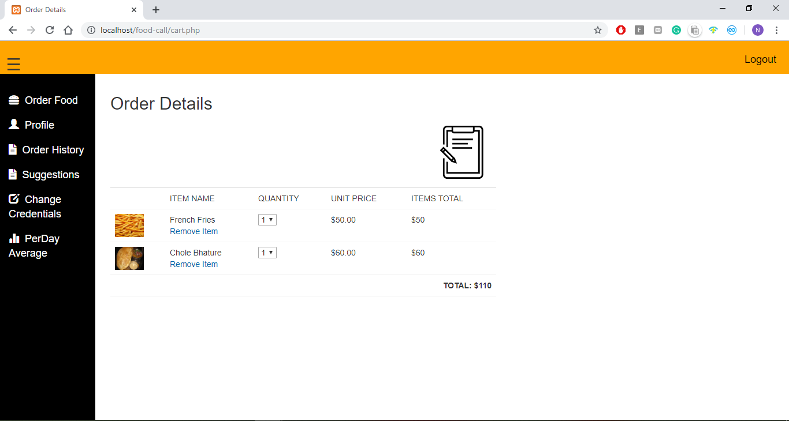

# food-call

- A Web Application for providing an interface to
the hostel students for ordering food from the hostel mess.
- Used PHP Mailer and third party local text service for sending email and
SMS notifications to the user about the itinerary status. 
- Used PHP for providing back-end and Bootstrap,HTML for front-end

## Screenshots

